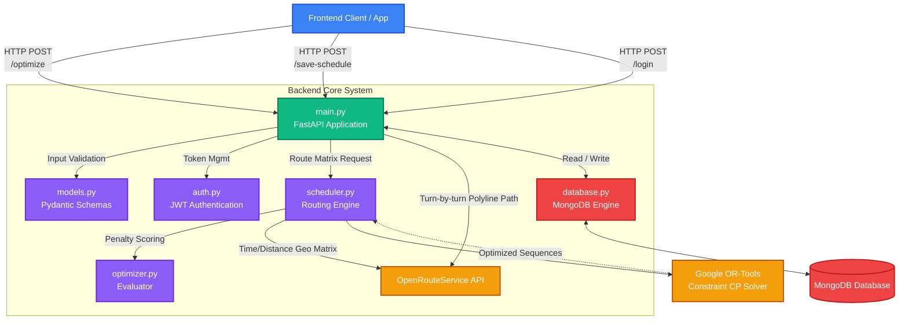

# Project Architecture

This document outlines the architecture and module responsibilities for the Route Optimization and Scheduling backend.

## Architecture Diagram

## Module Descriptions

1. **`main.py` (The Orchestrator)**
   The core entry point of the FastAPI application. It defines all the accessible API endpoints (`/optimize`, `/generate-frequency`, `/save-schedule`, `/login`, etc.). Under the hood, it receives data from the frontend and coordinates calling the other internal files to perform routing, validate security, fetch map polylines, and talk to the database.

2. **`scheduler.py` (The Solver Engine)**
   The heavy-lifting module where the actual complex mathematical operations occur. 
   * It builds abstract data models out of raw coordinates.
   * It connects to the external `OpenRouteService (ORS)` API to calculate real-world street transit times.
   * It spins up the `Google OR-Tools pywrapcp` router to calculate the optimal way to deploy buses to specific nodes so penalties are minimized based on the user's `optimize_for` constraints. 
   * It enforces time windows securely.

3. **`optimizer.py` (The Evaluator)**
   A lightweight, focused scoring module. Once a schedule has been finalized by `scheduler.py`, this module iterates through all assigned stops and calculates the total "penalty" scale. It evaluates if a sequence arrived too early or too late, assigns penalty points, and returns the final score summarizing how effective the routing solution was.

4. **`models.py` (Data Structures & Blueprints)**
   This module handles input validation using Pydantic. It ensures that any data coming from the frontend is strictly typed. It defines objects like the `ScheduleRequest` (requiring coordinates and node tolerances) and `UserCreate` (preventing malformed email addresses). If frontend data breaks these rules, it rejects the request before it crashes the engine.

5. **`database.py` (Persistence Layer)**
   A clean isolation layer managing the connection strings and cursor objects to MongoDB. It defines the collections (like `users_collection` and `schedules_collection`) so that `main.py` can fetch or save records asynchronously without worrying about database initialization nuances.

6. **`auth.py` (Security & User Identity)**
   Handles all authentication procedures. It securely hashes passwords so they aren't stored in plain-text, verifies logins, and generates JSON Web Tokens (JWT) using `datetime` expirations. It provides dependency injection (like `get_current_user`) so endpoints in `main.py` lock out unauthorized users seamlessly.
